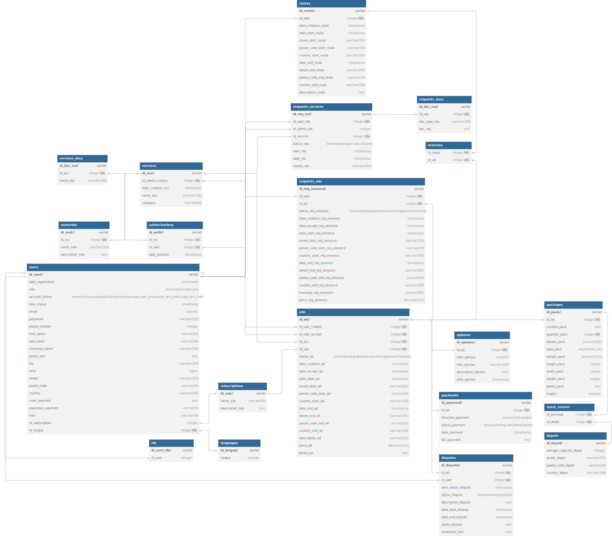

## **Descriptif fonctionnel**

### **1. Concept**

**1.1. Contexte et objectifs de l'application**

EcoDeli est une entreprise de mise en relation entre clients et prestataires de services. Son objectif principal est d’optimiser la logistique des livraisons tout en réduisant les coûts et l’empreinte carbone, en utilisant les trajets des particuliers et/ou professionnels déjà prévus. Avec le temps, elle a également élargi son offre en proposant un réseau de prestataires pour divers services (transport, installations, entretien, etc.).

Ce document détaille le descriptif technique du projet en termes de développement informatique sur les différentes applications commandées par l’entreprise :

-	Application web et mobile (public)
-	Application data (interne)

L’application web doit offrir une interface utilisateur et administrative ergonomique et sécurisée permettant d’assurer l’intermédiation pour les prestations de service. Elle doit être développée de manière évolutive et durable pour accompagner la croissance de l’entreprise.

L’application de visualisation des données servira de tableau de bord pour les employés d’EcoDeli afin de ?

**1.2. Public cible**

L’analyse des besoins a permis d’identifier et de segmenter les utilisateurs en six profils distincts :

-	L’administrateur : Supervision de la plateforme, gestion des utilisateurs, modération des contenus.
-	Le client particulier : Utilisateurs simples de l’application, recherches et demandes de prestations.
-	Le client professionnel : Entreprise ou commerce procédant à des recherche et demandes de prestations.
-	Le prestataire particulier : Particulier proposant des prestations définies comme la livraison sur ses trajets personnel.
-	Le prestataire professionnel : Entreprise ou commerce proposant des services réguliers. 
-	Collaborateur : Utilisateurs de l’application de visualisation de données de l’entreprise

### **2.	Architecture**

**2.1. Vue d’ensemble**

- **Front-end Web** : Développé avec Next.js et React.js, utilisant Tailwind CSS pour le style et OneSignal pour les notifications.
- **Front-end Mobile** : Application mobile native en Kotlin.
- **Front-End Data** : ?
- **Back-end** : API REST développée en Java avec Spring Boot, assurant la logique métier et les interactions avec les bases de données.
- **Base de données SQL** : PostgreSQL, utilisée pour stocker les utilisateurs, les annonces, les transactions et les métadonnées critiques.
- **Base de données NoSQL** : MongoDB, utilisée pour gérer les messages en temps réel et toute donnée non structurée nécessitant un accès rapide.
- **Authentification et Sécurité** : Gestion des accès via JWT, stockage sécurisé des clés et certificats via Azure Key Vault.
- **CI/CD** : Automatisation du déploiement via Azure DevOps.
- **Hébergement** : Déploiement sur Azure Cloud pour les environnements de test, avec une production sur serveur dédié.
- **Conteneurisation** : Utilisation de Docker pour l’isolation des services et le déploiement simplifié.

**2.2 Structure**  

```
/app
│── /eco-deli-data
│── /eco-deli-mobile
│── /eco-deli-web
│    ├── /pages                         # Pages du front-end (Next.js)
│    ├── /components                    # Composants réutilisables
│    ├── /styles                        # Styles (Tailwind CSS)
│    │── /docker                        # Fichiers de configuration Docker (Dockerfile)
│    │── .env                           # Variables d'environnement (base de données, Azure Key Vault)
│    ├── azure-pipelines.yml            # Fichier de pipeline CI/CD Azure DevOps
│    │── docker-compose.yml             # Configuration Docker pour le projet
│    ├── next.config.js                 # Configuration Next.js
│    └── package.json                   # Dépendances front-end, Docker et CI/CD
│    
│── /eco-deli-rest
│    ├── /controller                    # Contrôleurs API (Spring Boot)
│    ├── /service                       # Logique métier
│    ├── /repository                    # Accès à la base de données (PostgreSQL et MongoDB)
│    ├── /model                         # Modèles de données
│    ├── /config                        # Configuration (Azure Key Vault, DB)
│    ├── /security                      # Sécurisation (JWT, Azure Key Vault)
│    │── /docker                        # Fichiers de configuration Docker (Dockerfile)
│    │── .env                           # Variables d'environnement (base de données, Azure Key Vault)
│    │── application.properties         # Configuration des services
│    │── azure-pipelines.yml            # Fichier de pipeline CI/CD Azure DevOps
│    │── docker-compose.yml             # Configuration Docker pour le projet
│    ├── package.json                   # Dépendances Docker et CI/CD
│    └── pom.xml                        # Dépendances Java
```

### **3.	Modèle de données**

**3.1. Description**

La méthode employée pour la conception de la base de données repose sur une approche relationnelle et modulaire, garantissant scalabilité, évolutivité et maintenabilité. L'objectif principal est de permettre l'ajout de nouveaux services et fonctionnalités sans perturber l'architecture existante. Le choix d’un double système de base de données repose sur les besoins fonctionnels distincts, PostgreSQL permettra de gérer efficacement la quasi totalité des entités relationnelles et MongoDB sera idéal pour un stockage rapide et flexible des messages échangés en temps réel ou des traductions motivé par leurs natures non structurée et volumineuse.

**3.2. Modèle conceptuel et logique des données**

Le modèle relationnel est donc structuré des tables suivantes :
**users** : Stocke les informations des utilisateurs, incluant leur rôle, leur statut de compte, leurs coordonnées, ainsi que leurs informations de paiement et d’abonnement.
**services** : Contient les services proposés sur la plateforme.
**authorizations** : Définit les habilitations des utilisateurs à préscrire un service ou non.
**requests** : Suit les demandes des utilisateurs pour accéder à une habilitations à un service.
**requests_docs** : Stocke les documents liés aux demandes de service.
**services_docs** : Contient les documents nécéssaires pour être habiliter a un service.
**materials** : Contient les besoins associés à un service.
**ads** : Représente les annonces de demandes de livraison d'un client ou de prestation d'un préstataire.
**requests_ads** : Gère les demandes des clients pour postuler à des annonces (prestations).
**routes** : Définit les trajets des utilisateurs.
**matches** : Associe les annonces aux trajets correspondants pour optimiser les livraisons.
**packages** : Contient les informations sur les colis.
**stock_control** : Associe les entrepôts aux colis stockés.
**depots** : Représente les entrepôts avec leur capacité de stockage et leur localisation.
**disputes** : Suit les litiges liés aux annonces.
**opinions** : Stocke les avis des utilisateurs sur les annonces.
**payments** : Gère les paiements liés aux annonces.
**subscriptions** : Stocke les types d’abonnements avec leurs descriptions.
**languages** : Liste les langues disponibles sur la plateforme.
**nfc** : Référence les cartes NFC associées aux prestataires.




### **4. Fonctionnalités principales**

**4.1. Listing global**

L’application web et mobile propose donc un ensemble de fonctionnalités adaptées aux différents profils d’utilisateurs identifiés visant à offrir une expérience fluide et efficace, le tableau ci-dessous détaille les fonctionnalités accessibles après inscription selon le type de compte :

| **Fonctionnalité** | **Client Particulier** | **Client Professionnel** | **Prestataire Particulier** | **Prestataire Professionnel** | **Administrateur** |
|--|--|--|--|--|--|
| Création d’annonce : demande de livraison de colis | ✅ | ✅ | ✅ | ✅ | ❌ |
| Création d’annonce : fournir ses disponibilités pour des prestations | ❌ | ❌ | ❌ | ✅ | ❌ |
| Demande d’un créneau sur une prestation (+ création d'une conversation) | ✅ | ✅ | ✅ | ✅ | ❌ |
| Accepter, refuser ou négocier une demande de créneau sur une prestation | ❌ | ❌ | ❌ | ✅ | ❌ |
| Suivre son colis en temps réel | ✅ | ✅ | ✅ | ✅ | ❌ |
| Proposer un trajet pour livraison de colis | ❌ | ❌ | ✅ | ✅ (si habilité) | ❌ |
| Choisir un colis à livrer | ❌ | ❌ | ✅ | ✅ (si habilité) | ❌ |
| Scanner la carte NFC d'un livreur | ✅ | ✅ | ✅ | ✅ | ❌ |
| Poster un avis sur un service | ✅ | ✅ | ✅ | ✅ | ❌ |
| Entamer un litige sur un service | ✅ | ✅ | ✅ | ✅ | ❌ |
| Entamer un litige contre un client | ❌ | ✅ | ❌ | ✅ | ❌ |
| Modifier ses informations personnelles | ✅ | ❌ (limiter) | ✅ | ❌ (limiter) | ❌ |
| Modifier son abonnement | ✅ | ✅ | ✅ | ✅ | ❌ |
| Exporter ses factures | ✅ | ✅ | ✅ | ✅ | ❌ |
| Exporter ses données | ✅ | ✅ | ✅ | ✅ | ❌ |
| Consulter ses avis, services passés et statistiques financières | ✅ | ✅ | ✅ | ✅ | ❌ |
| Contacter un administrateur via messagerie interne | ✅ | ✅ | ✅ | ✅ | ❌ |
| Se désinscrire | ✅ | ✅ | ✅ | ✅ | ❌ |
| S’inscrire en tant que prestataire particulier | ✅ | ❌ | ❌ | ❌ | ❌ |
| Faire une demande pour être habilité à une prestation | ❌ | ✅ | ❌ | ✅ | ❌ |
| Ajouter/modifier/supprimer des annonces | ❌ | ❌ | ❌ | ❌ | ✅ |
| Ajouter/modifier/supprimer des prestations | ❌ | ❌ | ❌ | ❌ | ✅ |
| Ajouter/modifier/supprimer un abonnement | ❌ | ❌ | ❌ | ❌ | ✅ |
| Ajouter/modifier/supprimer un nouvel entrepôt | ❌ | ❌ | ❌ | ❌ | ✅ |
| Valider les demandes d’habilitation et d’inscription | ❌ | ❌ | ❌ | ❌ | ✅ |
| Gérer les comptes utilisateurs | ❌ | ❌ | ❌ | ❌ | ✅ |
| Gérer les avis utilisateurs | ❌ | ❌ | ❌ | ❌ | ✅ |
| Consulter et répondre aux messages utilisateurs | ❌ | ❌ | ❌ | ❌ | ✅ |
| Consulter les statistiques du site | ❌ | ❌ | ❌ | ❌ | ✅ |
| Gérer et traiter les litiges | ❌ | ❌ | ❌ | ❌ | ✅ |
| Consulter et exporter toutes les factures | ❌ | ❌ | ❌ | ❌ | ✅ |
| Consulter le tracking de tous les colis | ❌ | ❌ | ❌ | ❌ | ✅ |
| Créer des administrateurs | ❌ | ❌ | ❌ | ❌ | ✅ |

**4.2. Authentification** 
**4.3. Gestion utilisateur**
**4.4. Gestion des annonces**
**4.5. Messagerie**
**4.6. Livraison**
**4.7. Notifications**
**4.8. Paiements et facturations**
**4.9. Avis**
**4.10. Litiges**
**4.11. Administration**
**4.12. Middleware**
authMiddleware → Protection des routes avec authentification
roleMiddleware → Restriction d’accès en fonction des rôles
errorMiddleware → Gestion des erreurs globales


### **5. Interface utilisateur (UI/UX)**
Charte Graphique (logo, palette de couleurs (codes HEX/RGB), typographie (titres, textes, boutons), iconographie et illustrations)
Design System (Composants : boutons (primaire, secondaire, désactivé, etc.), formulaires (champs texte, dropdowns, checkbox, radio), modales et alertes, gestion des états (chargement, erreurs, succès))
Wireframes & Maquettes (Wireframes basse fidélité (esquisses des pages principales), Maquettes haute fidélité (écrans détaillés avec le design final) avec adaptations mobile/tablette/desktop)
### **6. Sécurité**
Authentification et autorisation : Détails sur les mécanismes de sécurité utilisés (ex. : JWT, OAuth).
Utilisation d'Azure Key Vault : Sécuriser les identifiants.
Protection des données sensibles : Chiffrement, sécurité des paiements, gestion des informations personnelles.
Mesures contre les attaques courantes : CSRF, XSS, injection SQL, etc.
### **7. Gestion des performances et scalabilité**
Optimisation du temps de réponse : Stratégies pour assurer des performances élevées (cache, indexation, etc.).
Scalabilité : Comment l'application peut évoluer avec un nombre d’utilisateurs croissant.
### **8. Tests et validation**
Tests unitaires : Description des tests réalisés sur chaque fonctionnalité.
Tests d’intégration : Comment les différents modules sont testés ensemble.
Tests de performance et de charge : Comment l’application est testée sous forte utilisation.
### **9. Déploiement et maintenance**
Pipeline de déploiement : Outils et processus pour déployer l'application (CI/CD).
Monitoring et logs : Systèmes mis en place pour surveiller la santé de l’application et la gestion des erreurs.
Mise à jour et évolution : Processus pour mettre à jour l’application en production.
### **10. Annexes**
Glossaire : Définitions des termes techniques.
Guide API : swagger
Convention de dev : API, front, tcheck responsive, git, sql, js, java, indentation, nommage des variables, fonction 

- Utiliser l’anglais pour le code (noms de fichiers, variables, commits, etc.).  
- Utiliser des noms clairs et significatifs pour les variables et fonctions.  
- Ne jamais committer du code qui ne compile pas.  
- Faire attention aux fichiers .env (ne pas les committer).  
- Toujours valider les entrées utilisateur côté client et serveur.  
- Éviter le stockage de mots de passe en clair, utiliser bcrypt.  

| Élément | Convention | Exemple |
|---------|-----------|---------|
| Variables | kebab-case | `user-profile` |
| Classes CSS | kebab-case | `.btn-primary` |
| Fichiers & Dossiers | kebab-case | `user-profile.ts` |
| Fonctions, Props, Hooks | camelCase | `getUserData()` |
| Constantes | SCREAMING_SNAKE_CASE | `API_URL` |

**JavaScript & TypeScript**  
- Indentation : 2 espaces.  
- Guillemets : `'` (simples), sauf en JSX (`"` doubles).  
- Fonctions fléchées privilégiées : `const fetchData = () => { ... }`
- Constantes et `let` seulement (pas de `var`).  

**Node**  
- Utiliser `async/await` et toujours gérer les erreurs avec `try/catch`.  

**React**  
- Un seul composant par fichier.  
- Utiliser useState, useEffect, useContext avec parcimonie.  

**Tailwind**  
- Utiliser `@apply` pour éviter trop de classes dans le JSX.  
- Créer des composants stylisés pour éviter la répétition de code.  
- Pas de styles inline, sauf exception.  
- Respecter la lisibilité (max 3-4 classes par ligne).  

**SQL**  
- Nommage des tables : Pluriel en snake_case (`user_profiles` et non `UserProfiles`).  
- Noms courts, explicites et en minuscules.  
- Clés primaires auto-incrémentées.  
- Relations claires :  
  - Clé primaire : préfixe `id` (`id_user`).  
  - Clé étrangère : préfixe `fk` (`fk_role_id`).  
  - Dates : préfixe `date` (`date_created`).  
- Types recommandés :  
  - `INT` ou `BIGINT` pour les identifiants numériques.  
  - `VARCHAR` pour les chaînes de texte de taille variable.  
  - `DATE` ou `DATETIME` pour les dates et heures.  
  - Éviter `TEXT` ou `LONGTEXT`, sauf si nécessaire (ralentit les requêtes).  
- Limiter les droits en SQL (`GRANT SELECT, INSERT, UPDATE` au lieu de `ALL PRIVILEGES`).  
- Éviter les SELECT * en SQL, préférer des colonnes spécifiques.  

**Git**  
- Branche `main` : Stable et déployable.  
- Branche `dev` : Intégration des nouvelles features.  
- Branche `feature/nom-feature` : Une branche par fonctionnalité.  
- Commits clairs et formatés (`git commit -m "type: message"`) :  
  - `feat:` Ajout d'une feature.  
  - `fix:` Correction de bug.  
  - `chore:` Maintenance / mise à jour.  
  - `refactor:` Amélioration sans changement fonctionnel.  
- Pas de commits volumineux, découper en petites étapes.  
- Code review obligatoire avant de merger une PR.  
