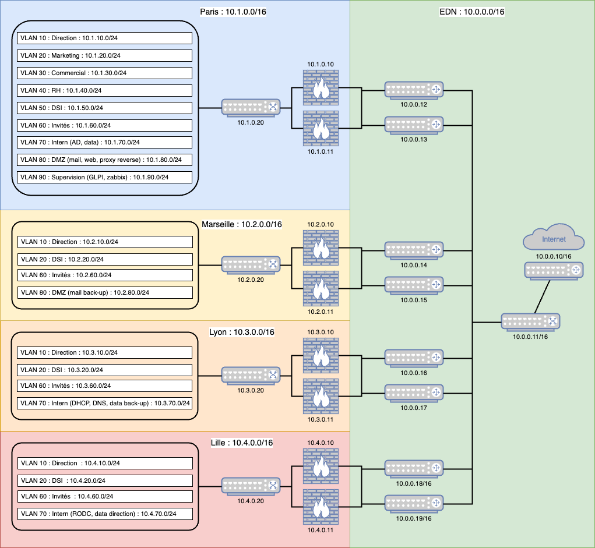

## **Document d'Architecture Technique**

### **1. Contexte**
Face à la croissance exponentielle d'EcoDeli, l’entreprise a décidé d’être à la fois son propre fournisseur d’accès à Internet (FAI) et de gérer l’intégralité de ses connexions intersites, ainsi que son propre datacenter. L’infrastructure doit donc répondre aux besoins suivants :
- Assurer une connectivité sécurisée entre les différents sites de l’entreprise.
- Garantir la disponibilité des services critiques (web, mail, stockage).
- Mettre en place une redondance efficace pour éviter les interruptions de service.
- Sécuriser les flux inter-sites et externes grâce à des règles de firewalling strictes.
- Déployer une solution de monitoring pour surveiller la performance et la disponibilité des équipements.
- Sécuriser l’accès aux données sensibles en appliquant des politiques d’accès et de chiffrement.
- Permettre un accès distant sécurisé aux employés itinérants.

Actuellement, la structure du groupe repose sur six sites distincts :  
- **Paris** : siège et cœur de l’activité  
- **Marseille, Lille et Lyon** : agences principales  
- **Montpellier et Rennes** : en cours de déploiement  

Les équipes basées au siège se composent de :  
- **Équipe de direction** (5 personnes) : PDG, DRH, DSI, Directeur Commercial, Directrice Marketing  
- **Commerciaux itinérants** (5 personnes) : peuvent naviguer entre toutes les agences  
- **Équipe marketing & communication** (3 personnes) : dirigée par Lucas Hauchard  
- **Équipe informatique** (8 personnes)  
- **Ressources humaines** (4 personnes) : couvrent l’ensemble de la région parisienne  
- **Autres employés** (30 personnes) : répartis entre les agences régionales et les entreprises clientes  

Et sur chaque site en province :  
- **2 salariés** sont rattachés aux équipes de la direction  
- **4 techniciens IT** (sauf à Rennes et Montpellier) assurent le bon fonctionnement des infrastructures  

Chaque employé, quel que soit son lieu de travail, dispose d’un ordinateur professionnel fourni par l’entreprise.  

### **2. Schéma d’architecture**
Pour une entreprise en croissance, il est préférable d’adopter un schéma d’adressage IP évolutif et bien structuré, basée sur 10.0.0.0/8, qui offre une grande flexibilité (65534 adresses IP disponibles) ce qui permet d'ajouter de nouveaux sites et/ou VLANs sans contrainte majeure. 

Le réseau EDN basé sur l’adresse 10.0.0.0/16 connecte donc tous les sites régionaux via des routeurs dédiés, l'interconnexion s'établiera via RIP v2, IPSec over GRE, des ACLs ainsi que la mise en place de HSRP et chaque site disposera d'une segmentation VLAN adaptée à ses besoin : 

### **3. Technologies**
- **Environnement de virtualisation :** Proxmox
- **Switch :** ? (x5)
- **Routeurs :** OPNSense (x9)
- **Firewalls :** OPNSense (x8)
- **Serveur de stockage :** Debian 12 (x2) – Stockage centralisé + back-up
- **Serveur AD, DHCP, DNS, RODC :** Windows Server 2022 (x3) – Gestion des utilisateurs
- **Serveur de supervision :** Debian 12 (x1) – Héberge Zabbix et GLPI
- **Serveur Web & Proxy :** Debian 12 (x1) – Serveur Apache/Nginx + Reverse Proxy
- **Serveur Mail :** Debian 12 (x2) – Postfix & Serveur mail sécurisé + back-up
- **Serveur de stockage :** Debian 12 (x1) – Stockage partagé direction 
- **Machines collaborateurs :** Windows Pro 11 (x60)